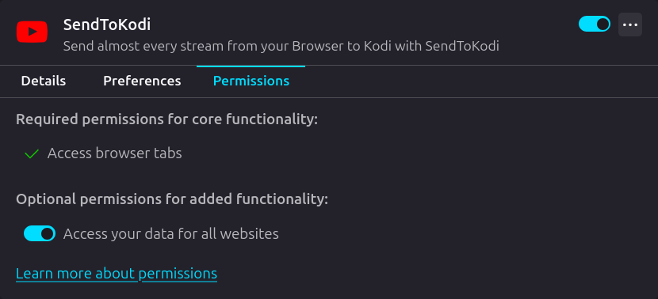

# SendToKodi

[](https://chrome.google.com/webstore/detail/sendtokodi/gbcpfpcacakaadapjcdchbdmdnfbnbaf)
[](https://chrome.google.com/webstore/detail/sendtokodi/gbcpfpcacakaadapjcdchbdmdnfbnbaf)
[](https://addons.mozilla.org/firefox/addon/sendtokodi/)
[](https://addons.mozilla.org/firefox/addon/sendtokodi/)
[](LICENSE.md)
[](https://github.com/firsttris/chrome.sendtokodi)

> Stream almost any video from your browser directly to Kodi - Simple, powerful, and open source.

## ✨ Features

- 🎬 **Universal Streaming** - Support for [1000+ websites](https://github.com/yt-dlp/yt-dlp#supported-sites) via yt-dlp
- 📋 **Playlist Support** - Send entire playlists with a single click
- 🔄 **Multiple Connections** - Save and manage different Kodi instances
- 🚀 **One-Click Send** - Stream instantly from your browser
- 🔒 **Privacy-Focused** - No data collection, fully open source
- 🎨 **Modern UI** - Built with React and modern web technologies

## 📦 Installation

### Chrome Web Store
[](https://chrome.google.com/webstore/detail/sendtokodi/gbcpfpcacakaadapjcdchbdmdnfbnbaf)

### Mozilla Add-ons
[](https://addons.mozilla.org/firefox/addon/sendtokodi/)

### Microsoft Edge Add-ons
[](https://microsoftedge.microsoft.com/addons/detail/sendtokodi/cfaaejdnkempodfadjkjfblimmakeaij)

## 📋 Requirements

To use this extension, you need to install the SendToKodi Addon in Kodi:

**Kodi Addon:** [plugin.video.sendtokodi](https://github.com/firsttris/plugin.video.sendtokodi)

The addon handles the actual streaming on the Kodi side and must be installed for this extension to work.

## 🔧 Configuration for Firefox

After installing the extension in Firefox, you need to configure permissions to allow access to all website URLs. This is required for the extension to function properly with all supported sites.

1. Open the Firefox Add-ons Manager by navigating to `about:addons`.
2. Locate the **SendToKodi** extension and click on the gear icon or the settings button.
3. Go to the **Permissions** tab.
4. Enable the option **Access your data for all websites**.

Here’s an example of how the permissions screen should look:



## 🛠️ Tech Stack

- **Framework**: [React](https://react.dev/) - UI library
- **Build Tool**: [Vite](https://vitejs.dev/) - Fast build tool
- **Styling**: Custom CSS
- **Linting**: [Biome](https://biomejs.dev/) - Fast formatter and linter
- **Language**: TypeScript

## 💻 Development

### Prerequisites

- Node.js 20 or higher
- npm

### Setup

```bash
# Clone the repository
git clone https://github.com/firsttris/chrome.sendtokodi.git
cd chrome.sendtokodi

# Install dependencies
npm install

# Start development server
npm run start
# For Firefox compatibility
npm run start:firefox
```

### Load Extension

**Chrome:**
1. Open Chrome and navigate to `chrome://extensions/`
2. Enable **Developer mode** (toggle in top-right)
3. Click **Load unpacked**
4. Select the `build` folder from the project

**Firefox:**
1. Open Firefox and navigate to `about:debugging`
2. Click **This Firefox**
3. Click **Load Temporary Add-on...**
4. Select any file in the `build` folder

The extension will hot-reload as you make changes.

## 📤 Publishing

### Chrome Web Store

GitHub Actions workflow automates publishing to Chrome Web Store.

**Setup:**

1. Generate API credentials following [chrome-webstore-upload-keys](https://github.com/fregante/chrome-webstore-upload-keys)
2. Run `npx chrome-webstore-upload-keys` to get your `REFRESH_TOKEN`
3. Add these secrets to your GitHub repository:
   - `CHROME_EXTENSION_ID`
   - `CHROME_CLIENT_ID`
   - `CHROME_CLIENT_SECRET`
   - `CHROME_REFRESH_TOKEN`

**Deploy:**
```bash
# Trigger via GitHub Actions workflow
gh workflow run submit_chrome_webstore.yml
```

### Mozilla Add-ons

GitHub Actions workflow automates publishing to Mozilla Add-ons store.

**Setup:**

1. Go to [Mozilla Add-on API Keys](https://addons.mozilla.org/developers/addon/api/key/)
2. Generate your API credentials (JWT issuer and JWT secret)
3. Add these secrets to your GitHub repository:
   - `FIREFOX_EXTENSION_ID`
   - `FIREFOX_JWT_ISSUER`
   - `FIREFOX_JWT_SECRET`

**Deploy:**
```bash
# Trigger via GitHub Actions workflow
gh workflow run submit_firefox_addon.yml
```

### Microsoft Edge Add-ons

GitHub Actions workflow automates publishing to Edge Add-ons store.

**Setup:**

1. Go to [Microsoft Partner Center - Publish API](https://partner.microsoft.com/dashboard/microsoftedge/publishapi)
2. Generate API credentials
3. Add these secrets to your GitHub repository:
   - `EDGE_PRODUCT_ID`
   - `EDGE_CLIENT_ID`
   - `EDGE_API_KEY`

**Deploy:**
```bash
# Trigger via GitHub Actions workflow
gh workflow run submit_edge_store.yml
```

## 🔐 Privacy & Security

- **100% Open Source** - All code is available for review
- **No Tracking** - We don't collect any data
- **Local Processing** - Everything runs on your device
- **Transparent Permissions** - Only uses necessary browser APIs

## 🤝 Contributing

Contributions are welcome! Please feel free to submit a Pull Request.

**Special thanks to our contributors:**

- [@eeshugerman](https://github.com/eeshugerman) - Mozilla support [#3](https://github.com/firsttris/chrome.sendtokodi/pull/3)
- [@mauman](https://github.com/mauman) - Firefox manifest fixes [#14](https://github.com/firsttris/chrome.sendtokodi/pull/14)

## 📄 License

See the [LICENSE](LICENSE.md) file for license rights and limitations.
