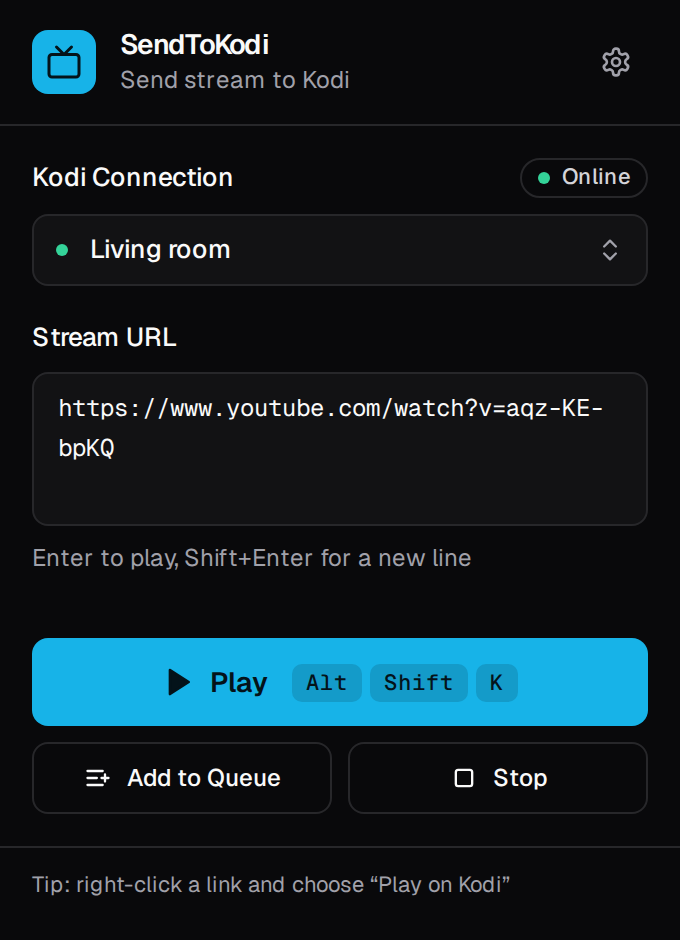
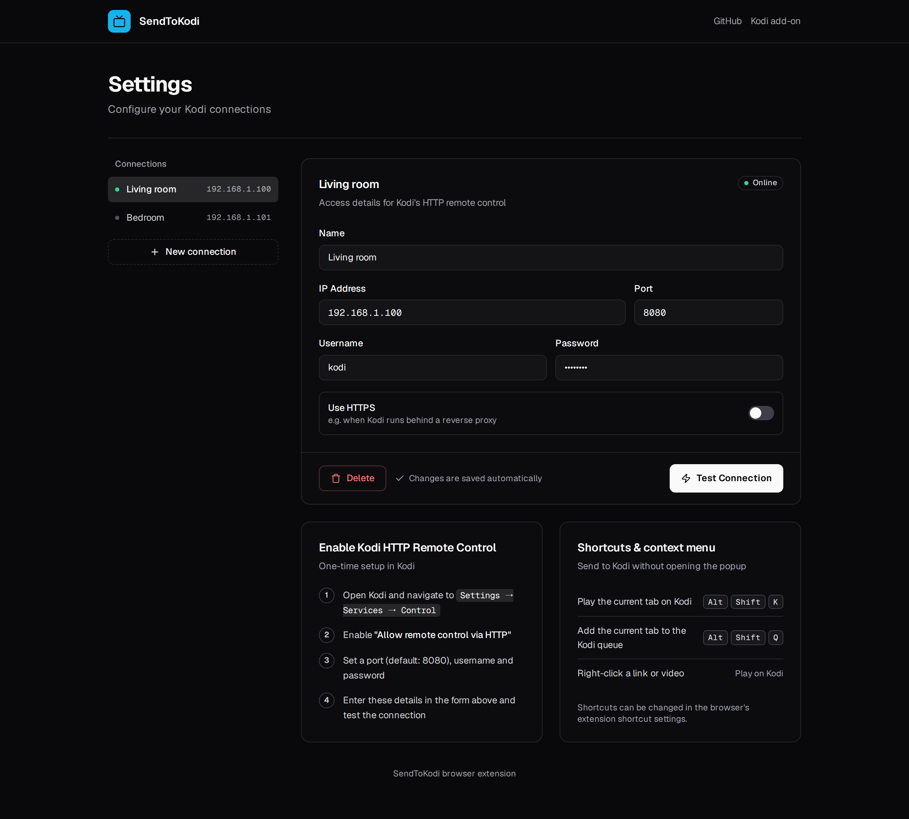

# SendToKodi Browser Extension: Send YouTube, Twitch and 1000+ Sites to Kodi

**Watch it in the browser, play it on the big screen.** 
SendToKodi for Chrome, Firefox and Edge sends the video you are watching to [Kodi](https://kodi.tv) with one click:
YouTube, Twitch, Vimeo, SoundCloud and [1000+ other websites](https://github.com/yt-dlp/yt-dlp/blob/master/supportedsites.md).

 

[Install](#-install) •
[Setup](#-setup-in-3-steps) •
[Usage](#-usage) •
[Troubleshooting](#-troubleshooting) •
[Privacy](#-privacy--permissions) •
[Documentation](https://firsttris.github.io/chrome.sendtokodi/)

  
  &nbsp;&nbsp;
  

## 💡 Why SendToKodi?

You found a video on your laptop and want to watch it on the TV. Instead of mirroring your screen or typing a URL into
Kodi, you click the SendToKodi icon, and Kodi plays the video on its own, in the best quality the site offers, with
Kodi's player, subtitles and remote. Your browser only sends the link; the
[SendToKodi Kodi add-on](https://github.com/firsttris/plugin.video.sendtokodi) resolves it with
[yt-dlp](https://github.com/yt-dlp/yt-dlp). Think of it as a **"cast to Kodi" button** that works on every video site.

## ✨ Features

- 🎬 **One click to Kodi**: Open the popup on any video page and press **Play**. The URL of the current tab is already filled in.
- 📋 **Queue instead of interrupting**: Add videos to Kodi's playlist while something else is playing.
- 🖱️ **Context menu**: Right-click a link, video or page and choose **Play on Kodi** or **Add to Kodi queue**, without opening the video.
- ⌨️ **Keyboard shortcuts**: `Alt+Shift+K` plays the current tab, `Alt+Shift+Q` queues it, without opening the popup.
- 🔄 **Several Kodi devices**: Save a connection for each one (living room, bedroom, …) and switch between them.
- 🟢 **Connection status**: See at a glance whether your Kodi is reachable.
- 🌍 **English and German**, follows your browser language.
- 🔒 **Private**: No tracking and no servers in between. Your browser talks directly to your Kodi, and the extension asks for access to that one address only, never to the websites you visit.
- 🧩 **Chrome, Firefox, Edge, Brave, Vivaldi, Opera**, and Firefox for Android.

## 📦 Install

It also works in other Chromium-based browsers such as Brave, Vivaldi and Opera via the Chrome Web Store, and in
Firefox for Android via Mozilla Add-ons.

## 🚀 Setup in 3 steps

### 1. Install the SendToKodi add-on in Kodi

The browser extension only tells Kodi *what* to play. The **[SendToKodi Kodi add-on](https://github.com/firsttris/plugin.video.sendtokodi)**
does the actual work: it uses [yt-dlp](https://github.com/yt-dlp/yt-dlp) to resolve the website into a playable
stream. Follow its [installation guide](https://firsttris.github.io/plugin.video.sendtokodi/installation.html).

### 2. Allow remote control in Kodi

1. In Kodi, open **Settings → Services → Control**.
2. Turn on **Allow remote control via HTTP**.
3. Note the **port** (default `8080`) and set a **username** and **password**.

You can find the IP address of your Kodi device under **Settings → System information → Network**.

### 3. Connect the extension

1. Click the SendToKodi icon in the browser toolbar and then the ⚙️ gear icon.
2. Enter the IP address, port, username and password from step 2.
3. Click **Test Connection**. When the browser asks for access to your Kodi, click **Allow**.

When you see *Connection successful* and the status badge says **Online**, you're done. For more room, use the full
settings page via the ↗ icon in the popup (or *Extension options* in your browser). Several devices, HTTPS behind a
reverse proxy and Kodi on another network: [Setup guide](https://firsttris.github.io/chrome.sendtokodi/setup.html).

  

## 🎬 Usage

| What you want | How to do it |
| --- | --- |
| Play the current tab | Click the SendToKodi icon → **Play**, or press `Alt+Shift+K` |
| Add the current tab to the queue | Click the icon → **Add to Queue**, or press `Alt+Shift+Q` |
| Play a link without opening it | Right-click the link → **Play on Kodi** |
| Queue a link | Right-click the link → **Add to Kodi queue** |
| Play any URL | Paste it into the popup's URL field and press `Enter` |
| Stop playback | Click the icon → **Stop** |
| Switch Kodi devices | Pick another connection in the popup's dropdown |

When you use the context menu or a shortcut, the toolbar icon briefly shows **✓** if it worked or **!** if it didn't.
Hover over the icon to read the message.

**Changing the shortcuts:** open `chrome://extensions/shortcuts` (Chrome, Brave, …), `edge://extensions/shortcuts`
(Edge) or, in Firefox, `about:addons` → ⚙️ → *Manage Extension Shortcuts*.

## 🔧 Troubleshooting

- **"Connection failed – Kodi not reachable":** Kodi running, same network, correct IP and port, *Allow remote
  control via HTTP* on, *Use HTTPS* off (Kodi itself only speaks HTTP), no firewall on the port.
- **"Wrong username or password":** use exactly the credentials from Kodi's *Settings → Services → Control*.
- **"Access to Kodi was not granted":** click **Test Connection** in the popup again and choose **Allow**. The
  context menu and the shortcuts can't show this prompt, so test once from the popup first.
- **"Kodi error: … – is the SendToKodi addon installed?":** the Kodi add-on is missing or outdated. Install or
  update it.
- **Kodi starts, but the video doesn't play:** that's the Kodi add-on's part. Update yt-dlp in its settings and see its
  [troubleshooting guide](https://firsttris.github.io/plugin.video.sendtokodi/troubleshooting.html).

Every message, with its cause and fix, is in the
[troubleshooting guide](https://firsttris.github.io/chrome.sendtokodi/troubleshooting.html). Still stuck?
[Open an issue](https://github.com/firsttris/chrome.sendtokodi/issues) with your browser, Kodi version and the error
message.

## 🔐 Privacy & permissions

SendToKodi collects **no data**. There is no tracking and no analytics, and no server sits between your browser and
Kodi. Your connections (including the Kodi password) are stored in your browser's extension storage and synced with
your browser account if you have sync turned on.

| Permission | Why |
| --- | --- |
| Access to your Kodi's address (e.g. `http://192.168.1.100`) | To send commands to Kodi. Requested only when you first test a connection or play something. |
| Active tab | To read the URL of the current tab, only when you click the icon or use a shortcut. |
| Context menus | For *Play on Kodi* and *Add to Kodi queue*. |
| Storage | To save your Kodi connections. |

The extension does **not** need access to the websites you visit. All code is open source and can be reviewed in
this repository. Full details: [Privacy Policy](./PRIVACY.md) ·
[Privacy & permissions](https://firsttris.github.io/chrome.sendtokodi/privacy.html).

## ❓ FAQ

**Which sites work?** Everything [yt-dlp supports](https://github.com/yt-dlp/yt-dlp/blob/master/supportedsites.md),
plus direct links to media files. DRM-protected services (Netflix, Disney+, Prime Video) do not work.

**Do I need the Kodi add-on?** Yes. The extension sends the link, the add-on resolves and plays it.

**Does it work from a different network?** Only if the browser can reach Kodi's address, for example through a VPN or
a reverse proxy with HTTPS. See the [setup guide](https://firsttris.github.io/chrome.sendtokodi/setup.html#kodi-on-another-network).

**Is there an Android or iOS version?** Use Kore on Android and the Apple Shortcut on iPhone and Mac; both are
described in the [Kodi add-on's documentation](https://firsttris.github.io/plugin.video.sendtokodi/usage.html).

## 📖 Documentation

The full documentation is at **[firsttris.github.io/chrome.sendtokodi](https://firsttris.github.io/chrome.sendtokodi/)**:
[installation](https://firsttris.github.io/chrome.sendtokodi/installation.html),
[setup](https://firsttris.github.io/chrome.sendtokodi/setup.html),
[usage](https://firsttris.github.io/chrome.sendtokodi/usage.html),
[troubleshooting](https://firsttris.github.io/chrome.sendtokodi/troubleshooting.html),
[privacy & permissions](https://firsttris.github.io/chrome.sendtokodi/privacy.html),
[how it works](https://firsttris.github.io/chrome.sendtokodi/how-it-works.html),
[development](https://firsttris.github.io/chrome.sendtokodi/development.html) and
[releases](https://firsttris.github.io/chrome.sendtokodi/releases.html). The source is in [docs/](docs/README.md).

## 🤝 Contributing

Bug reports, ideas and pull requests are welcome! See [CONTRIBUTING.md](./CONTRIBUTING.md) for how to build and run
the extension locally and how releases work.

**Thanks to our contributors:**

- [@eeshugerman](https://github.com/eeshugerman): Mozilla support ([#3](https://github.com/firsttris/chrome.sendtokodi/pull/3))
- [@mauman](https://github.com/mauman): Firefox manifest fixes ([#14](https://github.com/firsttris/chrome.sendtokodi/pull/14))

---

⭐ Like SendToKodi? A [star on GitHub](https://github.com/firsttris/chrome.sendtokodi) helps others find it. 
🐛 [Report a bug](https://github.com/firsttris/chrome.sendtokodi/issues/new) · 💡 [Request a feature](https://github.com/firsttris/chrome.sendtokodi/issues/new)

License: <a href="LICENSE.md">MIT</a> · © Tristan Teufel and contributors 
Kodi is a trademark of the XBMC Foundation. This project is not affiliated with the XBMC Foundation, Google, Mozilla or Microsoft.

