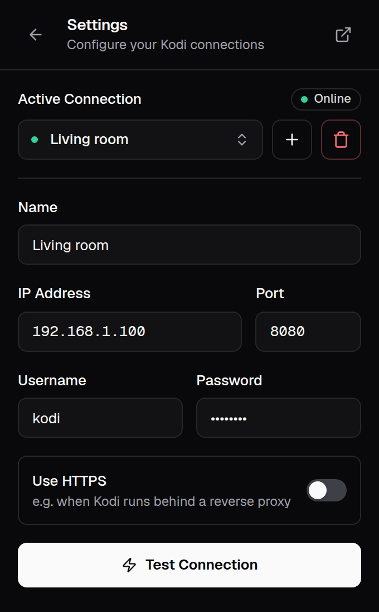

# SendToKodi documentation

SendToKodi is a browser extension for **Chrome, Firefox, Edge** and other Chromium browsers that sends the video you
are watching to your [Kodi](https://kodi.tv) media center with one click. It works with YouTube, Twitch, Vimeo,
SoundCloud and [1000+ other websites](https://github.com/yt-dlp/yt-dlp/blob/master/supportedsites.md), because the
[SendToKodi Kodi add-on](https://github.com/firsttris/plugin.video.sendtokodi) resolves the link with
[yt-dlp](https://github.com/yt-dlp/yt-dlp) on the Kodi side.

This site has the details: installation and setup, every way to send a video, what each error message means, what the
extension may and may not do, and how it is built. For the quick overview, see the
[README on GitHub](https://github.com/firsttris/chrome.sendtokodi#readme).

  
  &nbsp;&nbsp;
  

## Users

| | |
|---|---|
| [Installation](installation.md) | The extension from the Chrome Web Store, Mozilla Add-ons or Edge Add-ons, other Chromium browsers, Firefox for Android, and the Kodi add-on it needs |
| [Setup](setup.md) | Turning on Kodi's web server, entering the connection, granting access, several Kodi devices, HTTPS behind a reverse proxy |
| [Usage](usage.md) | Play and queue from the popup, the keyboard shortcuts, the context menu, pasting any URL, stopping, switching devices, changing the shortcuts |
| [Troubleshooting](troubleshooting.md) | Every error message and what to do about it, from *Kodi not reachable* to *is the SendToKodi addon installed?* |
| [Privacy & permissions](privacy.md) | What the extension stores and sends, which permissions it asks for and why, the privacy policy |

## Background

| | |
|---|---|
| [How it works](how-it-works.md) | The JSON-RPC request to Kodi, the plugin URL, optional host permissions, the popup, the background worker and the storage |
| [Development](development.md) | Tech stack, local setup with hot reload, loading the extension in Chrome and Firefox, checks and tests, project structure, translations |
| [Releases](releases.md) | Version bump, tags, the GitHub release and the automatic uploads to the three stores |

## The two halves of SendToKodi

The extension only tells Kodi *what* to play. The **Kodi add-on** does the work: it resolves the website into a
playable stream and plays it. Both are needed, and both are documented:

- Browser extension (this site): [firsttris.github.io/chrome.sendtokodi](https://firsttris.github.io/chrome.sendtokodi/)
- Kodi add-on: [firsttris.github.io/plugin.video.sendtokodi](https://firsttris.github.io/plugin.video.sendtokodi/)

If a website does not play on Kodi although the extension reports success, the cause is on the Kodi side; its
documentation has the [troubleshooting](https://firsttris.github.io/plugin.video.sendtokodi/troubleshooting.html)
for that.
