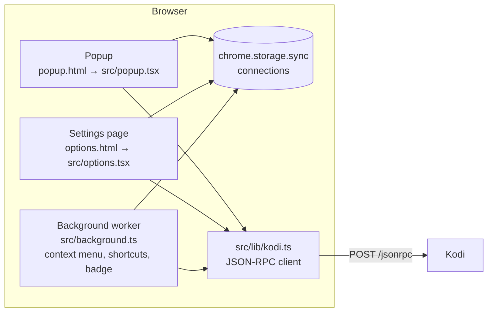

# How it works

The extension is small on purpose: it has to get a URL from the browser to Kodi and report whether Kodi accepted it.
Resolving the website and playing it is the Kodi add-on's job. This page shows the request, the parts of the
extension and the decisions behind them.

## The request to Kodi

Kodi has a [JSON-RPC API](https://kodi.wiki/view/JSON-RPC_API) on its web server. The extension sends one `POST` to
`http://<ip>:<port>/jsonrpc` with HTTP basic authentication and the method `Player.Open`:

```json
{
  "jsonrpc": "2.0",
  "id": 1,
  "method": "Player.Open",
  "params": {
    "item": {
      "file": "plugin://plugin.video.sendtokodi/?https://www.youtube.com/watch?v=TLNdBIRTNM4"
    }
  }
}
```

The `file` is a plugin URL of the SendToKodi Kodi add-on. Kodi starts the add-on with it, the add-on resolves the
website with yt-dlp and hands the stream to Kodi's player. The extension builds two forms of the URL:

| Action | Plugin URL |
|---|---|
| Play | `plugin://plugin.video.sendtokodi/?<media URL>` (the legacy form; the add-on reads everything after `?` as the URL, so it is not encoded) |
| Queue | `plugin://plugin.video.sendtokodi/?action=queue&url=<encoded URL>&title=<encoded title>` |

*Stop* calls `Player.GetActivePlayers` and then `Player.Stop` for each player; the reachability check calls
`JSONRPC.Ping`. Everything is in `src/lib/kodi.ts`, with tests next to it. Requests time out after eight seconds.

Kodi answers `"result": "OK"` as soon as it has accepted the item, before the website is resolved. That is why the
extension can report success while Kodi later shows *Could not resolve the url*: the two halves report
independently. The add-on's documentation describes the
[plugin URL in full](https://firsttris.github.io/plugin.video.sendtokodi/integration.html).

## Errors

`sendJsonRpc` turns every failure into a `KodiError` with a code, and the UI translates the code into a message:

| Code | Cause | Message |
|---|---|---|
| `noHost` | The connection has no address | *No IP address configured* |
| `permission` | The host permission for the address was not granted | *Access to Kodi was not granted* |
| `timeout` | No answer within eight seconds | *Kodi did not respond in time* |
| `unreachable` | `fetch` failed (connection refused, DNS, TLS) | *Connection failed – Kodi not reachable* |
| `unauthorized` | HTTP 401 | *Wrong username or password* |
| `http` | Another HTTP status, or invalid JSON | *Kodi responded with an error* |
| `rpc` | A JSON-RPC error from Kodi, typically because the add-on is missing | *Kodi error: … – is the SendToKodi addon installed?* |

Only `timeout` and `unreachable` mark a connection as *Offline*; a 401 proves Kodi is there.

## Permissions: optional host access

The extension is Manifest V3 and asks for as little as possible:

- `activeTab` gives the URL and title of the current tab, only after a click on the icon or a shortcut.
- `storage` and `contextMenus` for the settings and the menu entries.
- The Kodi address is an **optional host permission** (`optional_host_permissions` for `http://*/*` and
  `https://*/*`). Nothing is granted at install time; `chrome.permissions.request` asks for exactly the origin of the
  connection (`http://192.168.1.100/*`) the first time you test or play. Ports are not part of match patterns, so
  one grant covers any port on that host.

Browsers only allow the permission prompt inside a user gesture, and in Firefox it must be the first asynchronous
call in the click handler. The popup and the settings page therefore request the permission before anything else.
The background worker (context menu, shortcuts) cannot prompt at all; it checks with `chrome.permissions.contains`
and, when the permission is missing, shows the error on the badge and opens the settings page.

## Parts of the extension



- **Popup and settings page** are the same Solid.js app (`src/renderApp.tsx`) with different root components. The
  `StoreProvider` holds the connections and writes them to `chrome.storage.sync` with a short debounce, because sync
  storage allows only a limited number of writes per minute. The `ApiProvider` runs the Kodi actions, holds the status
  message and the reachability of the active connection.
- **The background service worker** registers the two context menu entries on install and on browser start, listens
  to menu clicks and to the two commands, loads the active connection from storage and sends the request. It never
  shows UI; the result goes to the toolbar badge (**✓** or **!**, with the message as the icon's tooltip) for four
  seconds. In Firefox the same file runs as an event page, which the build configures.
- **Storage** is `chrome.storage.sync`: the list of connections and the ID of the selected one. On load, connections
  are repaired (missing IDs, duplicate names, missing ports) so old data from earlier versions keeps working.
- **Translations** come from `public/_locales/<lang>/messages.json` via `chrome.i18n`; English and German exist and
  the browser picks by its UI language.

## Firefox and Chrome from one source

The manifest is shared; `vite.config.ts` adjusts it for Firefox at build time: the background script becomes an event
page instead of a service worker, and `browser_specific_settings.gecko` sets the add-on ID, the minimum Firefox version
and declares that no data is collected. Everything else, including the `chrome.*` namespace, works in Firefox as is.

## Why it is built this way

- **No content scripts.** The extension never injects code into pages, which keeps it fast, keeps the permission list
  short and avoids breaking on site changes. The URL of the tab is all it needs.
- **No server in between.** The browser talks to Kodi on the local network. Nothing to host, nothing to trust, nothing
  that can go offline.
- **Resolving on the Kodi side.** yt-dlp runs where the video is played. The extension stays the same when yt-dlp
  changes, and the same Kodi add-on serves Android, iOS and scripts.
- **Optional host permission instead of `<all_urls>`.** The stores and the users see an extension that asks for one
  address, and the prompt names it.
